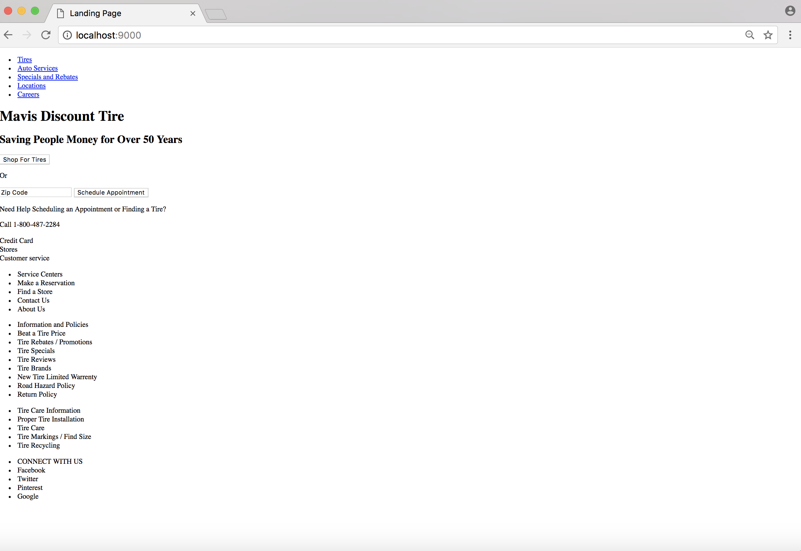

# lab1-msorbaro

I found this lab to be a lot of fun. I chose to take mavistire.com (which is a very ugly and unresponsive website) and make it look prettier based off of the example in the lab assignment. It has two call to action buttons, a search bar, a collapsing nav, and a collapsing footer. I tried to take the key aspects that the company was trying to get across and keep them on my website but in a cleaner and less word cluttered.

I liked using flex boxes. They were much easier to use then the basic CSS I was using before and it definitely made my website look cleaner. I also was proud of my self for getting the extra credit check box nav and footer to work. However, what did not work the best was using the vh for the height of all of my divs. This sometimes causes text to run over the div and not always look good which is not what I want. Besides that, I think I learned a lot and was able to look at code online and make it into what I needed for my website. Another thing that did not work was my sad attempt at designing but hopefully my design process improves as the term goes on.

Here is an image of my early phase designing.

Cool things to try:
1. Hover over all the buttons! The cool moving ones was taking from w3 school but the call one was done by me looking at the code!
2. Shrink the width- the nav will disapear as will some sections and the footer links.
3. Click on the nav when it is shrunk, the links will appear!
4. Click on the footers when the  screen is shrunk and they will also appear!

here is a link to mavistire.com which is where I stole the content from and the design website I copied was the one Professor put in the examples for the lab. 
